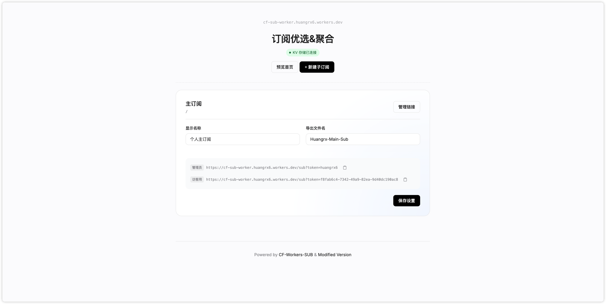

# 🌐 CF-Workers-SUB (Enhanced Edition)

> 一个基于 Cloudflare Workers 的高性能订阅聚合与优选工具，拥有极简且精致的现代化 UI。




## ✨ 功能特点

- **高性能部署**：基于 Cloudflare Workers 全球边缘网络，响应迅速。
- **界面优化**：简洁的伪玻璃拟态 UI，支持深色模式与移动端适配。
- **持久化存储**：使用 KV 数据库保存订阅信息，支持数据持久化。
- **可视化管理**：提供完整的图形化管理界面，支持订阅增删改查。
- **智能优选**：支持节点订阅聚合与自动优选 IP 替换。
- **便捷体验**：内置二维码生成、一键复制等实用功能。

## 🚀 快速部署

### 1. 准备工作
- 拥有一个 Cloudflare 账号。
- 安装 [Wrangler CI](https://developers.cloudflare.com/workers/wrangler/install-and-update/)。

### 2. 克隆项目
```bash
git clone https://github.com/your-repo/cf-workers-sub-enhanced.git
cd cf-workers-sub-enhanced
npm install
```

### 3. 配置 KV
在 `wrangler.toml` 中填入你的 KV 命名空间 ID：
```toml
[[kv_namespaces]]
binding = "KV"
id = "你的_KV_ID"
```

### 4. 部署上线
```bash
npx wrangler deploy
```

## ⚙️ 配置变量

你可以在 **Cloudflare Dashboard** -> **Settings** -> **Variables** 中设置，或直接在 `wrangler.toml` 中配置：

| 变量名 | 说明 | 示例 |
|:---|:---|:---|
| `TOKEN` | **必填** 管理员访问密码 | `mysecretpassword` |
| `GUEST` / `GUESTTOKEN` | 访客访问密码 (可选) | `guestpassword` |
| `SUBAPI` | 订阅转换后端地址 | `api.v1. mk` |
| `SUBCONFIG` | 订阅转换配置文件 URL | `https://.../config.ini` |
| `SUBNAME` | 默认订阅文件名 | `MySubscription` |
| `TGTOKEN` | Telegram Bot Token | `123456:ABC-DEF...` |
| `TGID` | Telegram Chat ID | `12345678` |

## 🙏 致谢 & Credits

本项目基于开源社区的优秀作品修改与增强，特别感谢以下项目的作者：

- **Core Functionality**: Powered by [cmliu/CF-Workers-SUB](https://github.com/cmliu/CF-Workers-SUB)  
  *感谢 cmliu 大佬提供的强大内核逻辑！*
  
- **Original Modification**: Based on [lzxaf/CF-Workers-SUB-Modified](https://github.com/lzxaf/CF-Workers-SUB-Modified)  
  *感谢 lzxaf 提供的基础修改版！*

---
Made with ❤️ by huangrx6
